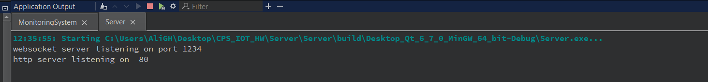
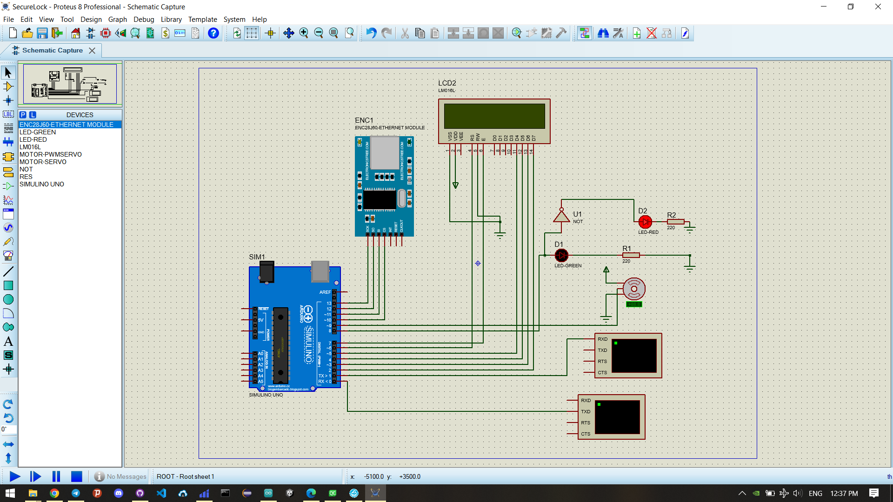
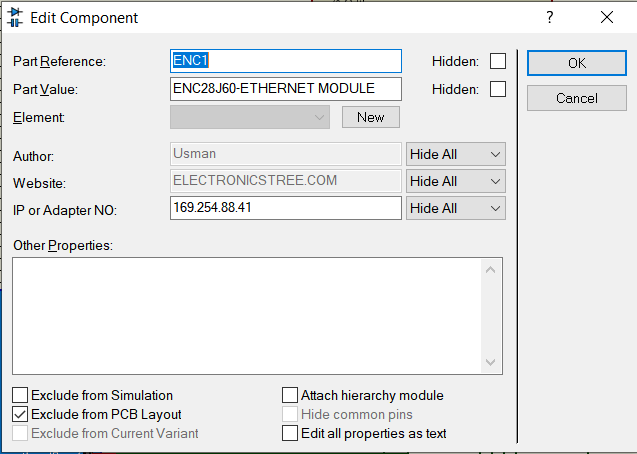
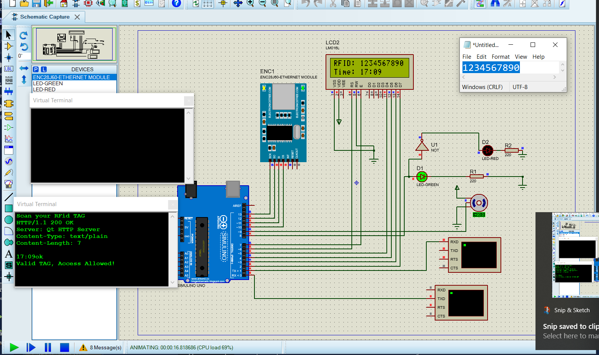
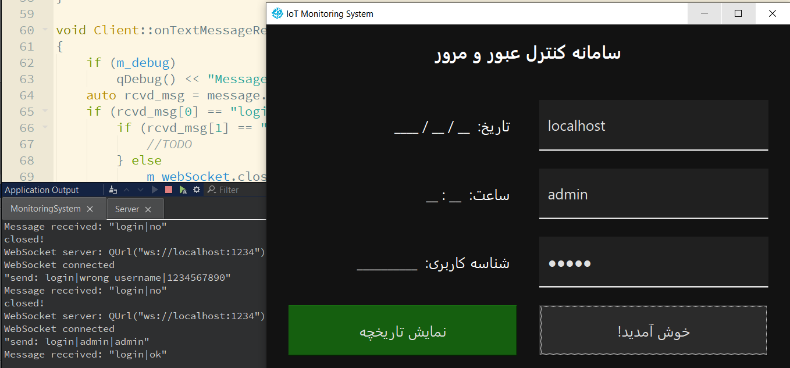
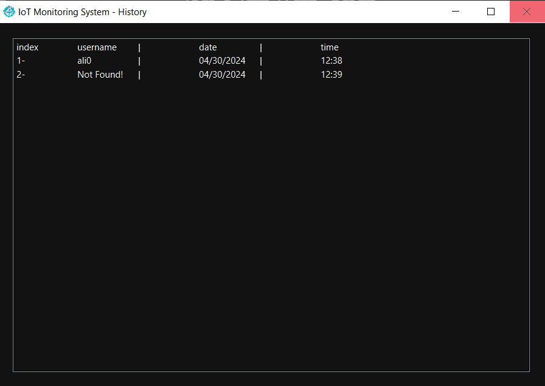
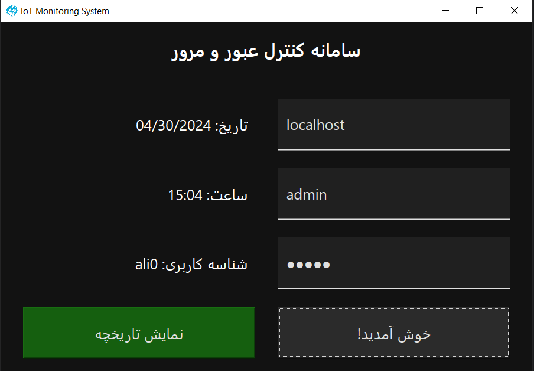
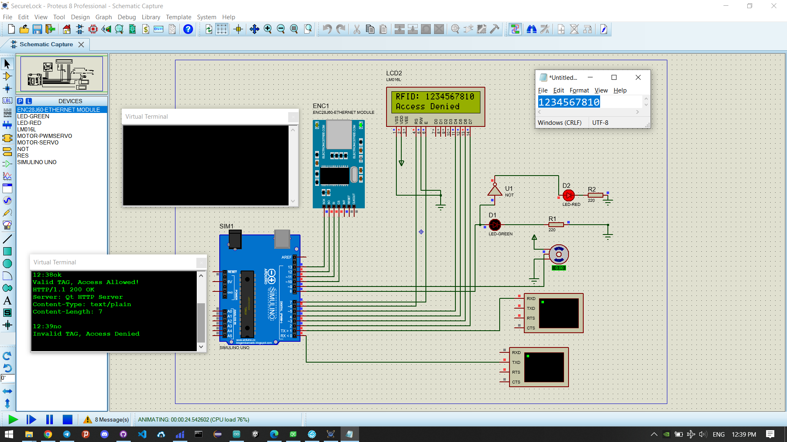

# HW1 - CPS - Entry and Exit Management System IoT

### Table of Contents  
- [Introduction](#introduction)
- [Background](#background)
- [Visual Results](#visual-results)
    - [Accept Scenario](#accept-scenario)
    - [Decline Scenario](#decline-scenario)
- [Code Explanation](#code-explanation) 
    - [Proteus and Arduino Uno Module](#proteus-and-arduino)  
    - [Main Web Server](#main-web-server)
    - [Administrator Client](#administrator-client)  
- [Conclusion](#conclusion) 


## Introduction

The goal of this project is to implement a system for managing entry and exit based on the Internet of Things (IoT) for a hypothetical company. The system consists of the following components:

1. Embedded System: This includes sensors and hardware modules. An RFID sensor is used to identify employees by reading their RFID tags (10-digit codes). A servo motor controls the opening and closing of the door, and two LED lights and monitors display the entry status and employee information.

2. Cloud (Web Server): A simple web server maintains a list of authorized individuals. Anyone not on this list is denied entry.

3. Monitoring System: A software application that connects to the web server via WebSocket and displays real-time event details.

The overall process works as follows: When an individual approaches the entrance, the RFID sensor reads their tag. The Arduino board sends this information to the web server for authentication. If authorized, the green LED turns on, the person's information is displayed, and the door opens. If not authorized, the red LED turns on, "Access Denied" is displayed, and the door remains closed.

The project involves setting up the hardware simulation in Proteus, implementing the web server and monitoring application using Qt framework in C++, and integrating all components. Additionally, there are bonus tasks like measuring end-to-end delays and using WebSocket for communication between the embedded system and the web server.

## Background

This project integrates several current industry concepts. Below is a brief overview of some of the key concepts involved:

- Internet of Things (IoT): The Internet of Things refers to the network of physical objects or "things" embedded with sensors, software, and other technologies that enable these objects to connect and exchange data with other devices and systems over the internet. IoT allows for the integration of the physical and digital worlds, enabling remote monitoring, control, and automation of various processes and activities. The concept of IoT has gained significant traction in recent years, with applications spanning across industries such as healthcare, manufacturing, transportation, and home automation.

- RFID (Radio Frequency Identification): RFID is a wireless technology that uses radio waves to identify and track objects, people, or animals. It uses readers and tags to transfer data via radio waves. A reader can communicate with a tag some distance away (between a few centimeters and 20 meters, depending on the type of RFID). Active RFID tags have batteries, which they can tap to send information to a reader. Passive RFID tags do not have batteries; they use a reader’s electromagnetic energy to communicate with the reader. There are also semi-passive RFID tags, meaning a battery runs the circuitry while communication is powered by the RFID reader. RFID is more expensive, bulkier and more prone to physical and electrical damages. Unlike barcodes, RFID can be read if they are not within the reader's line of sight.

    - How Does RFID Work?

        Every RFID system consists of three components: a scanning antenna, a transceiver and a transponder. When the scanning antenna and transceiver are combined, they are referred to as an RFID reader or interrogator. There are two types of RFID readers -- fixed readers and mobile readers. The RFID reader is a network-connected device that can be portable or permanently attached. It uses radio waves to transmit signals that activate the tag. Once activated, the tag sends a wave back to the antenna, where it is translated into data. The transponder is in the RFID tag itself. The read range for RFID tags varies based on factors including the type of tag, type of reader, RFID frequency and interference in the surrounding environment or from other RFID tags and readers. Tags that have a stronger power source also have a longer read range.

    - RFID Use in Industries:
        - Retail
        - Pharmaceutical and Health Care
        - Airline baggage
        - Passport
        - Libraries
        - Animal tagging

    - RFID Use Cases:
        - Item-level inventory
        - Tracking and monitoring
        - Timing
        - Management material
        - Logistics & supply chain visibility

    - Types of RFID Systems:
        - Low-frequency RFID systems
        - High-frequency RFID system
        - UHF RFID systems
        - Microwave RFID systems

- Proteus: Proteus is a professional software suite for circuit simulation and microcontroller programming. It provides a virtual environment for designing, testing, and simulating electronic circuits and embedded systems. In the context of this project, Proteus plays a crucial role in simulating the embedded system component, which includes the Arduino board, RFID sensor, servo motor, LED, and other hardware modules. By using Proteus, the project can be thoroughly tested and debugged in a virtual environment before deploying it on physical hardware, saving time and resources.

Incorporating a monitoring system in this project offers several advantages:

- Real-time Visibility: The monitoring system provides real-time visibility into the entry and exit events, allowing administrators or authorized personnel to monitor the activity instantly.
- Event Logging and Auditing: The system can maintain a log of all entry and exit events, which can be useful for auditing purposes, identifying potential security breaches, or analyzing traffic patterns.
- Centralized Management: With a dedicated monitoring application, the system can be managed and monitored from a centralized location, eliminating the need for physical presence at the entry point.
- Enhanced Security: By having a monitoring system in place, any unauthorized access attempts or suspicious activities can be quickly detected and addressed, improving the overall security of the premises.
- Data Analysis: The event data collected by the monitoring system can be analyzed to gain insights into employee attendance, peak hours, and other relevant metrics, which can aid in making informed decisions regarding resource allocation or operational efficiency.


Lastly, It's important to note the importance of the Qt framework in our project. This framework provides a comprehensive set of tools and libraries that are well-suited for developing the web server and monitoring application components of this project. Its cross-platform support ensures the applications can run on multiple operating systems without significant code changes. Qt's networking and web development modules simplify the implementation of the HTTP and WebSocket communication protocols required for the web server and client-server interactions. Additionally, Qt's GUI development capabilities enable the creation of a user-friendly monitoring application interface.

## Visual Results

Before we can describe our code and its components, we will demonstrate the result of this project. The demonstration includes both the scenarios where the user has/doesn't have access to open the door as well as the Proteus setup and configuration.

To run the program, we first need to build and run the web server configuration in QT environment.



We also need the Proteus configuration below which consists of the following modules: ENC28J60 (ethernet), LM016L (LCD), Servo motor, LED (x2 with resistors), Arduino Uno, Terminal Windows (optional), Not Gate. 



Please also note to set the appropriate IP for the ENC28J60 module.



## Accept Scenario

In our database, we will authorise all RFIDs with the following format. Note that you can change this code to your own liking.

```
Database::Database()
{
    for (int i = 0; i < 10; ++i) {
        QJsonObject member;
        member["username"] = "ali" + QString::number(i);
        member["rfid"] = "123456789" + QString::number(i);
        members.append(member);
    }
}
```

For instance, `1234567890` is a valid ID. As it is shown below, on valid inputs, the green led will turn on, the door will roate 90 degrees and the appropriate message is shown. Moreover, the time and rfid value are shown on the LCD module. 



On the server side, if we have the admin requirements, we can successfully log in to our account.



As an admin, we also have the privilege to observe users' activities. For example, we can see that there have been one successful and one unsucceful entry attemps at April 30, 2024 at 12:38 and 12:39 respectively.  



> **Note:** Please note that after we have had at least one succeful entry, the server interface will also show the last successful entry record.




## Decline Scenario

On another hand, on invalid inputs, the red led will turn on, the door will stay closed and the *Access Denied* message is shown. Moreover, the *Access Denied* and rfid value are shown on the LCD module. 



On the server side, if we have don't have the admin requirements, we cannot successfully log in to our account.


## Code Explanation

some random text.


## Proteus and Arduino Uno Module

some random text.


## Main Web Server

some random text.


## Administrator Client

some random text.


## Conclusion

some random text.

---

[Answers](Answers.md)
